# Investigating Cognitive Control via fMRI: A Comprehensive Data Analysis Report

## Abstract

This report presents a detailed analysis of the Flanker Dataset using functional magnetic resonance imaging (fMRI) to explore the neural basis of cognitive control. The study focuses on investigating differences in the BOLD signal between Congruent and Incongruent Flanker trials. Various analyses, including cognitive control assessment, quality control, preprocessing, statistical modeling, and post-analysis, were conducted using the FSL software. The findings contribute valuable insights into the neural mechanisms underlying cognitive control and response inhibition.

## Table of Contents

- [Introduction](#introduction)
- [Experimental Design](#experimental-design)
- [Data Collection](#data-collection)
- [Analysis](#analysis)
  - [Cognitive Control Assessment](#cognitive-control-assessment)
  - [Quality Control](#quality-control)
  - [Preprocessing](#preprocessing)
  - [First-Level Analysis](#first-level-analysis)
  - [Second-Level Analysis](#second-level-analysis)
  - [Third-Level Analysis](#third-level-analysis)
  - [ROI Analysis](#roi-analysis)
- [Results and Interpretation](#results-and-interpretation)
  - [First-Level Analysis Results](#first-level-analysis-results)
  - [Second-Level Analysis Results](#second-level-analysis-results)
  - [Third-Level Analysis Results](#third-level-analysis-results)
  - [ROI Analysis Results](#roi-analysis-results)
  - [Final Results](#final-results)
- [Discussion](#discussion)
- [Conclusion](#conclusion)
- [References](#references)
- [Submission](#submission)
- [Scripts](#scripts)

## Introduction

Cognitive control processes, particularly attention and response inhibition, were investigated using the Flanker Dataset and fMRI. This report details the experimental design, data collection procedures, and a comprehensive analysis pipeline.

## Experimental Design

The Flanker task, a well-established paradigm for studying cognitive control, was employed. Participants were presented with Congruent and Incongruent Flanker trials, requiring a button press based on the central arrow's direction.

## Data Collection

Twenty-six adult participants underwent fMRI scans while performing the Flanker task. High-resolution anatomical images and functional scans were acquired.

## Analysis

### Cognitive Control Assessment

To ensure reliable results, cognitive control was assessed by analyzing reaction times, demonstrating robust differences between congruent and incongruent conditions.

### Quality Control

Quality control procedures identified motion artifacts in specific subjects, addressing potential confounds in the subsequent analysis.

### Preprocessing

Anatomical and functional images underwent preprocessing steps, including brain extraction, temporal filtering, motion correction, and registration to the MNI152 template.

### First-Level Analysis

The first-level analysis included GLM modeling with contrasts for congruent and incongruent conditions. Post-stats analysis identified activated pixels and clusters.

### Second-Level Analysis

Different algorithms, including Fixed Effect, Flame 1, and Simple OLS, were applied in the second-level analysis to determine the most effective approach.

### Third-Level Analysis

Exploratory group analysis was performed using Flame 1 based on the Fixed Effect algorithm to assess the effectiveness of different algorithms.

### ROI Analysis

Regions of interest (ROIs) were identified and confirmed using a confirmation test to ensure the significance of the identified clusters.

## Results and Interpretation

### First-Level Analysis Results

1. **Contrast 1: Active congruent pixels only**
   - 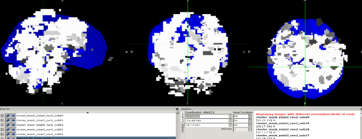 Active congruent pixels across the brain.

2. **Contrast 2: Active incongruent pixels only**
   - 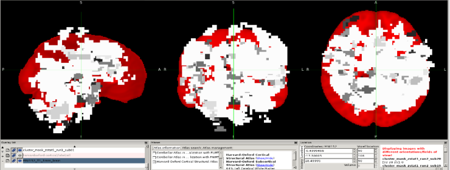 Active incongruent pixels throughout the brain.

3. **Contrast 3: Active incongruent minus congruent pixels only**
   - 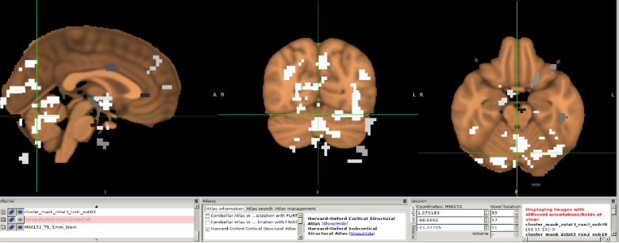 Active pixels showing specific regions of activation.

### Second-Level Analysis Results

4. **Flame 1 based on Fixed Effect**
   - 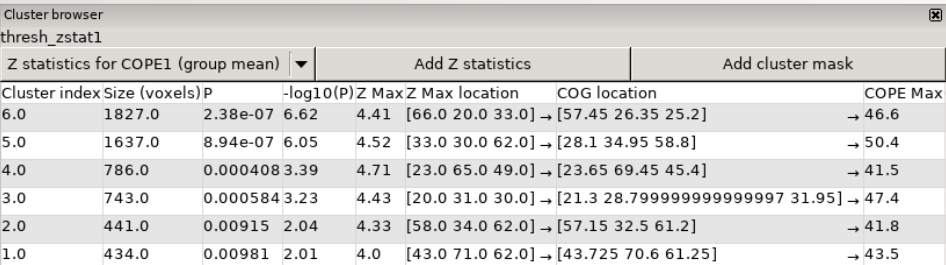 Results indicating the most favorable choosed algorithm.

5. **Flame 1 based on Flame 1**
   - 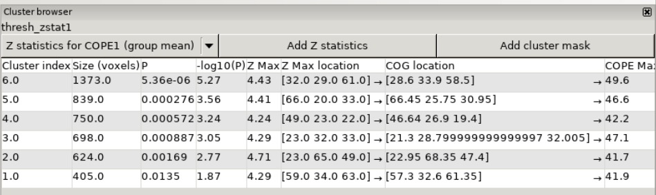 Results using the Flame 1 algorithm.

6. **Flame 1 based on Simple OLS**
   - 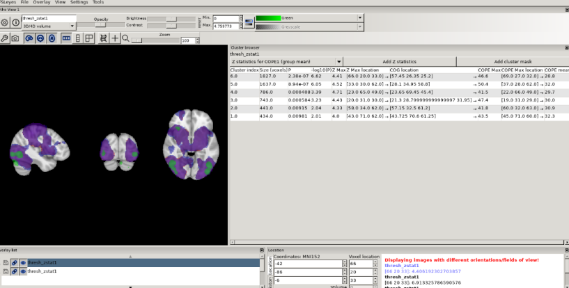 Results using Simple OLS.

### Third-Level Analysis Results

7. **Incongruent minus congruent clusters**
   - 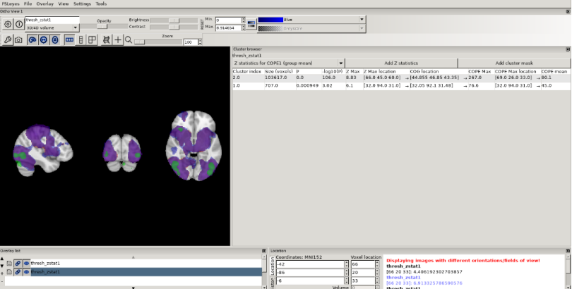 Clusters showing significant activation.

### ROI Analysis Results

8. **Contrast type dominance on each key point**
   - 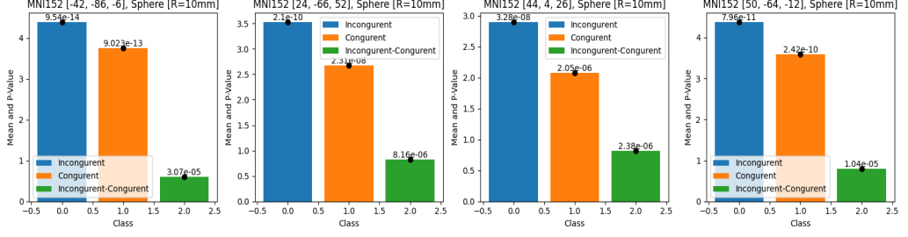 All key spheres exhibit a P-value <<< 0.001 for each contrast, signifying their statistical significance; furthermore, complete overlap enables the assessment of contrast ratios within the key point spheres, with Python code scripts utilized for mean calculation, one-sample t-tests, and figure generation.

### Final Results
9. **Cluster 3, 6 (Lateral Occipital Cortex, Inferior division) [Silver Color]**
   - 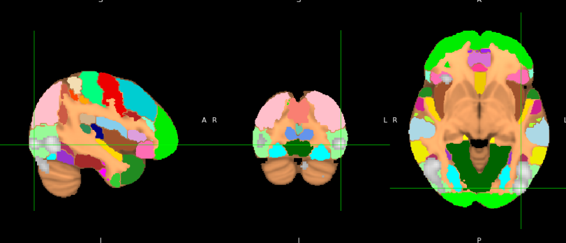 The flanker task's connection to the "Lateral Occipital Cortex, Inferior division" is indirect; although focused on cognitive control, the task involves initial visual processing, suggesting the cortex contributes to early visual analysis of flanker stimuli.

10. **Cluster 5 (Lateral Occipital Cortex, Superior division) [Silver Color]**
    - 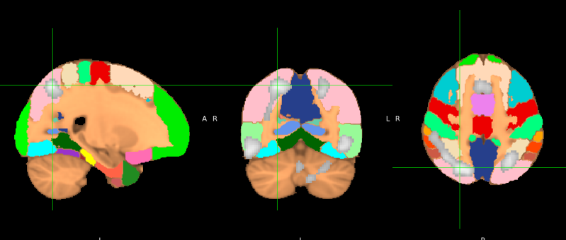 Reveals a non-direct association between the flanker task and the "Lateral Occipital Cortex, Superior division," primarily engaged in visual motion processing, indicating a potential involvement in aspects like motion perception during the flanker task.

11. **Cluster 4 (Precentral Gyrus) [Silver Color]**
    - 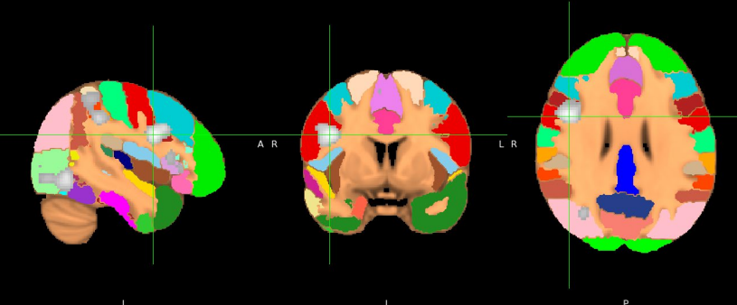 Illustrates an indirect link between the flanker task and the "Precentral Gyrus," a key area for motor control, with cognitive control regions like ACC, DLPFC, and IFG facilitating motor response execution during the task.

## Discussion

The results revealed indirect relationships between confirmed clusters and the flanker task. The discussion interprets these findings in the context of existing literature and theoretical frameworks.

## Conclusion

Despite indirect relationships observed, the study provides valuable insights into the neural mechanisms underlying cognitive control and response inhibition during the Flanker task.

## References

Kelly, A.M., Uddin, L.Q., Biswal, B.B., Castellanos, F.X., Milham, M.P. (2008). Competition between functional brain networks mediates behavioral variability. Neuroimage, 39(1):527-37
- Soares JM, Magalhães R, Moreira PS, Sousa A, Ganz E, Sampaio A, Alves V, Marques P and Sousa N (2016) A Hitchhiker’s Guide to Functional Magnetic Resonance Imaging. Front. Neurosci. 10:515. doi: 10.3389/fnins.2016.00515
- AndysBrainBook website (https://andysbrainbook.readthedocs.io/en/latest/)

## Submission

This report, authored by Mahmoud Yaser Salman, was submitted as the final project for the "Neuroimaging" course, under the guidance of Prof. Meena Makary.

## Scripts

The repository includes all scripts utilized in the analysis, many of which were graciously shared by my friend Omar Saad. These scripts, adapted from [Andy's Brain Book](https://andysbrainbook.readthedocs.io/en/latest/fMRI_Short_Course/fMRI_Intro.html), proved to be versatile and contributed significantly to achieving similar results. Unfortunately, my own scripts had to be removed due to unexpected issues with my WSL 2.0 setup. The entire analysis was conducted on Linux Ubuntu 22.04 using WSL 2.0 from a Windows environment.
