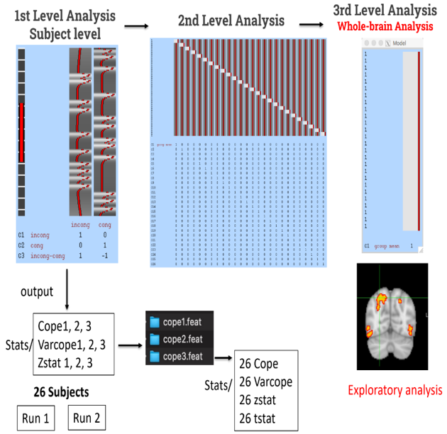

# Investigating Cognitive Control via fMRI: A Comprehensive Data Analysis Report

## Abstract

This report presents a detailed analysis of the Flanker Dataset using functional magnetic resonance imaging (fMRI) to explore the neural basis of cognitive control. The study focuses on investigating differences in the BOLD signal between Congruent and Incongruent Flanker trials. Various analyses, including quality control, preprocessing, statistical modeling, and post-analysis, were conducted using the FSL software. The findings contribute valuable insights into the neural mechanisms underlying cognitive control and response inhibition.

## Table of Contents

- [Introduction](#introduction)
- [Experimental Design](#experimental-design)
- [Data Collection](#data-collection)
- [Analysis](#analysis)
  - [Quality Control](#quality-control)
  - [Preprocessing](#preprocessing)
  - [First-Level Analysis](#first-level-analysis)
  - [Second-Level Analysis](#second-level-analysis)
  - [Third-Level Analysis](#third-level-analysis)
  - [ROI Analysis](#roi-analysis)
- [Results and Interpretation](#results-and-interpretation)
- [Discussion](#discussion)
- [Conclusion](#conclusion)
- [References](#references)
- [Submission](#submission)
- [Scripts](#scripts)

## Introduction

Cognitive control processes, particularly attention and response inhibition, were investigated using the Flanker Dataset and fMRI. This report details the experimental design, data collection procedures, and a comprehensive analysis pipeline.

## Experimental Design

Figure 1, Flanker Task Trial

The Flanker task, a well-established paradigm for studying cognitive control, was employed. Participants were presented with Congruent and Incongruent Flanker trials, requiring a button press based on the central arrow's direction.

## Data Collection

Twenty-six adult participants underwent 2 fMRI runs while performing the Flanker task. High-resolution anatomical images and functional scans were acquired.

## Analysis

Figure 1, Project Workflow

### Quality Control

Quality control procedures identified motion artifacts in specific subjects, addressing potential confounds in the subsequent analysis.

### Preprocessing

Anatomical and functional images underwent preprocessing steps, including brain extraction, temporal filtering, motion correction, smoothing, registration of functional to anatomical, and normalization to the MNI152 template.

### First-Level Analysis

The first-level analysis included GLM modeling with contrasts for congruent and incongruent conditions. Post-stats analysis identified activated pixels and clusters.

### Second-Level Analysis

Different algorithms, including Fixed Effect, Flame 1, and Simple OLS, were applied in the second-level analysis to determine the most effective approach "Fixed Effect".

### Third-Level Analysis

Whole-brain analysis was performed using Flame 1 based on the Fixed Effect algorithm.

### ROI Analysis

Regions of interest (ROIs) were identified and confirmed using a confirmation test to ensure the significance of the identified clusters.

## Results and Interpretation

### Lateral Occipital Cortex, Inferior Division

Figure 2, Lateral Occipital Cortex, Inferior Division

- To decrease false positives, Eklund (2016) suggested accepting only P-values < 0.001.
- Lateral Occipital Cortex, Inferior Division: Associated with visual processing, object recognition, and scene perception.
- Flanker Task: Focuses on cognitive control. However, participants still engage early visual areas while processing visual stimuli.

### Lateral Occipital Cortex, Superior division

Figure 3, Lateral Occipital Cortex, Superior Division

- Lateral Occipital Cortex, Superior division: Associated with visual motion information.
- Flanker Task: Focuses on cognitive control. However, participants still process visual motion information while processing visual stimuli.

### Precentral Gyrus

Figure 4, Precentral Gyrus

- Precentral Gyrus: Associated with motor control and movement initiation.
- Flanker Task: Requires cognitive control. Participants inhibit responses, supported by regions like the dorsolateral prefrontal cortex, which communicate with the precentral gyrus for motor execution, emphasizing its role in response control.
- Acknowledged no direct task link, like activating dorsomedial prefrontal cortex.

## Discussion

The results revealed indirect relationships between confirmed clusters and the flanker task. The discussion interprets these findings in the context of existing literature and theoretical frameworks.

## Conclusion

Despite indirect relationships observed, the study provides valuable insights into the neural mechanisms underlying cognitive control and response inhibition during the Flanker task.

## References

Kelly, A.M., Uddin, L.Q., Biswal, B.B., Castellanos, F.X., Milham, M.P. (2008). Competition between functional brain networks mediates behavioral variability. Neuroimage, 39(1):527-37
- Soares JM, Magalhães R, Moreira PS, Sousa A, Ganz E, Sampaio A, Alves V, Marques P and Sousa N (2016) A Hitchhiker’s Guide to Functional Magnetic Resonance Imaging. Front. Neurosci. 10:515. doi: 10.3389/fnins.2016.00515
- AndysBrainBook website (https://andysbrainbook.readthedocs.io/en/latest/)

## Submission

This [Report](Investigating-Cognitive-Control-via-fMRI_Report.pdf), authored by Mahmoud Yaser Salman, was submitted as the final project for the "fMRI Data Analysis" course, under the guidance of Prof. Meena M. Makary.

## Scripts

The repository includes all [scripts](scripts/) utilized in the analysis, many of which were graciously shared by my friend Omar Saad. These scripts, adapted from [Andy's Brain Book](https://andysbrainbook.readthedocs.io/en/latest/fMRI_Short_Course/fMRI_Intro.html), proved to be versatile and contributed significantly to achieving similar results. Unfortunately, my own scripts had to be removed due to unexpected issues with my WSL 2.0 setup. The entire analysis was conducted on Linux Ubuntu 22.04 using WSL 2.0 from a Windows environment.
